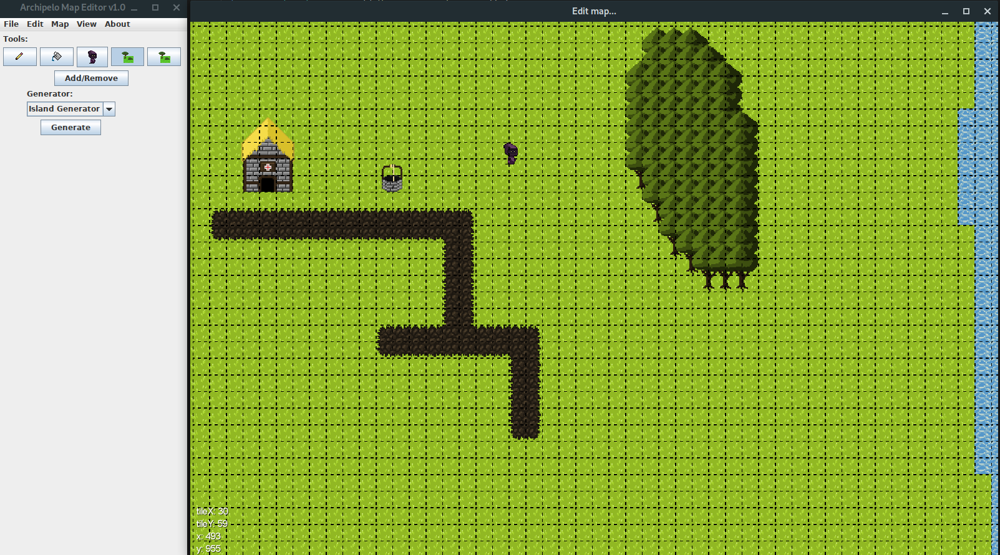

# ArchipeloEditor
Editor for various things related to Archipelo. This tool is designed for the developers of Archipelo to make it easier for us to work on maps, entity types, tile, elements and more, all related to Archipelo.



## Features

- Create maps with tiles, elements (trees, houses, etc), entities (signs, NPCs, etc) and export them in JSON format that is compatible with the [ArchipeloServer](https://github.com/hollowbit/ArchipeloServer).

- Blending tool: Automatically places borders between tiles to "blend" them. Ex: grass and sand

- Hold SHIFT to straight draw tile lines

- Add/remove chunks for more efficient map storage

- Use Map Generators to quickly generate maps (ex: islands with trees)

- Undo/redo any action

- Edit map properties (natural lighting, background music, etc)

- Organized tile and element lists with categories

- Generate and see collision maps

## Running the Editor

1. Install gradle
2. Do a gradle run to start the java program

```
$ gradle run
```